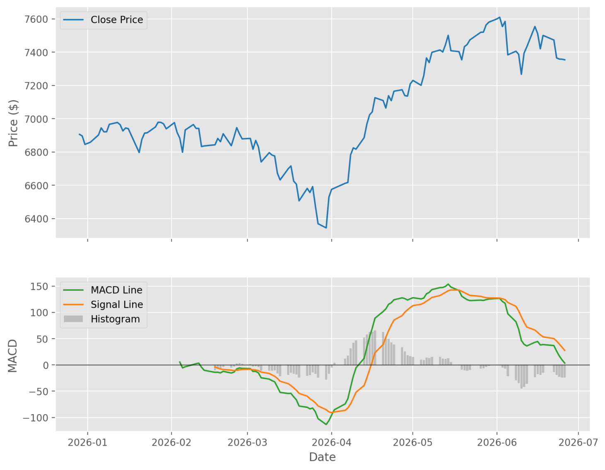

# MLOps Systems: Feature Engineering: Moving Average Convergence Divergence (MACD) in Python

Moving Average Convergence Divergence (MACD) is popular because it compresses multiple pieces of market behavior into a compact set of features: trend direction, momentum, and momentum acceleration. In a feature-engineering pipeline, MACD becomes a structured representation of how short-term movement compares with the longer-term baseline. In this implementation, I explain MACD and abstract it into code that is suitable for analytics pipelines and any further downstream modelling. his article is part of the MLOps Systems: Feature Engineering track, where we move from indicator mechanics to production-ready feature workflows.



The above image shows the close price of the S&P500 index along with MACD over the first 6 months of 2026. The histograms above 0 suggest a bullish momentum, while histograms below 0 suggest bearish momentum

## Problem

A raw close-price series tells you where price is, but not how short-term behavior compares to the broader trend. When making decisions on whether buying of selling an asset, it is often important to understand how the short term stock compares to the broader term

## MACD as a solution

MACD addresses the above problem by comparing two exponential moving averages (EMA) and then smoothing their difference again to create a signal line.

The result is three related features:

1. The MACD line for trend spread
2. The signal line for smoothed momentum confirmation
3. The histogram for momentum acceleration

## Solution (Code)

The core function validates inputs, computes fast and slow EMAs, derives the MACD line, and then computes both the signal line and histogram.

```python
def compute_macd(
    data: pd.DataFrame,
    fast: int = 12,
    slow: int = 26,
    signal: int = 9,
    close_column: str = "Close",
) -> pd.DataFrame:
    if data.empty:
        raise ValueError("Input data is empty.")
    if close_column not in data.columns:
        raise ValueError(f"Missing required column: {close_column}")
    if not (fast > 0 and slow > 0 and signal > 0):
        raise ValueError("fast, slow, and signal must all be positive integers.")
    if fast >= slow:
        raise ValueError("fast window must be smaller than slow window.")

    engineered = data.copy()
    close = engineered[close_column]

    ema_fast = close.ewm(span=fast, min_periods=fast, adjust=False).mean()
    ema_slow = close.ewm(span=slow, min_periods=slow, adjust=False).mean()

    macd_line = ema_fast - ema_slow
    signal_line = macd_line.ewm(span=signal, min_periods=signal, adjust=False).mean()

    engineered["macd_line"] = macd_line
    engineered["macd_signal"] = signal_line
    engineered["macd_histogram"] = macd_line - signal_line

    return engineered
```

### Fast and Slow EMA

Fast and Slow EMA are the foundation to MACD signals. The fast EMA reacts more quickly to recent price movement, while the slow EMA acts as a longer baseline. Their difference is a compact way to measure whether short-term price action is outperforming or underperforming the broader trend.

### Signal line

The MACD line alone can be jittery. The Signal Line Smooths out the trend with another EMA. The Signal line is then used to confirm directional shifts.

### Histogram

Subtracting the signal line from the MACD line produces the histogram line. This is often the most interesting of the three features because it indicates whether momentum is strengthening or weakening.

## Design Decisions and Edge Case Handling

The implementation makes several notable design decisions:

1. It validates that all windows are positive.
2. It explicitly rejects `fast >= slow`, which would undermine the indicator's meaning.
3. It returns all three outputs in a copied dataframe, making the function composable in a larger pipeline.
4. The use of `min_periods` on the EMA calculations is also important. It preserves warmup nulls rather than inventing values too early, which makes the resulting features more honest and easier to reason about.

## Tradeoffs and Pitfalls

1. Short datasets may produce many `NaN` values because MACD needs enough history for both EMAs and the signal EMA.
2. If `fast` and `slow` are too close together, the indicator may become less informative.
3. MACD is scale-sensitive to the close-price input. So, adjusted versus unadjusted data can change interpretation.
4. Like other technical features, MACD should be validated against leakage and resampling behavior in the surrounding pipeline.

## Usage and Considerations

> **Pro Tips**
> **Pro Tip 1** - Use the histogram as a standalone feature in addition to the MACD and signal lines; it often surfaces momentum changes earlier.
> **Pro Tip 2** - Tune `fast`, `slow`, and `signal` windows to your trading horizon instead of assuming 12/26/9 is always appropriate.
> **Pro Tip 3** - Keep warmup nulls visible until a deliberate downstream cleaning step so you do not blur feature provenance.

## Conclusion

This MACD implementation is aims to convert a trader-facing concept into pipeline-grade feature code. It is explicit, validated, and structured for reuse. That makes it useful not just for charts, but for any system that needs compact indicators of trend and momentum.

Key takeaways:

- MACD compresses trend direction, momentum, and momentum acceleration into three composable features that are easier to reason about than raw price movement.
- Built-in validation and immutable output make it a reliable primitive in production feature pipelines.
- Production use should include a clear warmup-row policy so training and scoring pipelines handle early `NaN` values consistently.

## Further Reading

- Exponential smoothing in technical indicators
- MACD histogram interpretation in momentum systems
- Feature provenance and warmup handling in time-series pipelines
