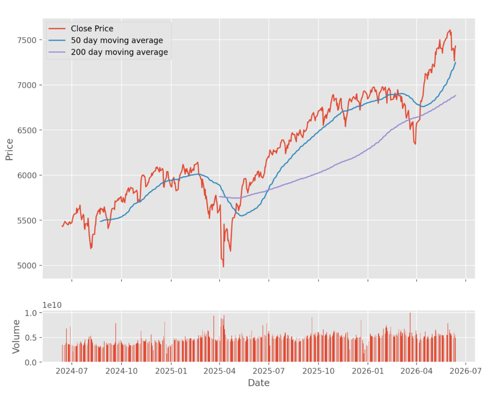

# [Part 1/8] MLOps Systems: Feature Engineering: Moving Averages for Noise-Resilient Trend Signals in Python

In production stock analytics, moving averages are essential because they convert noisy close-price streams into stable, model-friendly trend signals. Without this smoothing step, teams often face jittery alerts, unstable features, and weaker decision quality in downstream systems. In this post, I implement and explain a simple moving average (SMA) using Python and pandas as a practical feature-engineering primitive. By the end, you will know how to build and interpret SMA output in a way that is safe to integrate into a broader pipeline. This article is part of the MLOps Systems: Feature Engineering track, where we move from indicator mechanics to production-ready feature workflows.



The above image shows of the close price of the S&P500 index along with the SMA over 50 and 200 days

## Problem

Stocks Price series are full of small, random movements. If raw values are used directly in alerts, dashboards, or models, one can obtain jittery outputs and misleading triggers. The SMA provides a cleaner baseline by averaging values over a rolling window.

## Solution (Code)

Here is the full implementation:

```python
def moving_average(data, window_size):
    return data.rolling(window=window_size).mean()
```

This function does three things:

1. Accepts a sequence-like pandas object in `data`.
2. Builds rolling windows using `window_size`.
3. Computes mean for each window and returns the smoothed series.

A practical example:

```python
import pandas as pd

prices = pd.Series([100, 102, 101, 105, 107])
sma_3 = moving_average(prices, 3)
print(sma_3)
```

Expected output:

```text
0           NaN
1           NaN
2    101.000000
3    102.666667
4    104.333333
dtype: float64
```

The first `window_size - 1` rows are `NaN` because a full window is required before the mean can be computed.

## Design Decision

This implementation is intentionally minimal and idiomatic for pandas workflows. It is easy to read, fast enough for most feature pipelines, and composable with other transformations.

## Tradeoffs, Pitfalls and Edge Cases
The tradeoff is that input validation is not included. If `window_size` is invalid or larger than the dataset, behavior may not match business expectations unless handled upstream.

- `window_size <= 0` should be guarded against.
- `window_size > len(data)` can yield all `NaN` values.
- Non-numeric values in `data` may fail or produce unusable output.
- Missing values in input can propagate into rolling means.

## Usage and Considerations

> **Pro Tip 1**: Use multiple windows (for example 10, 20, 50) to capture short-, medium-, and long-term trend layers.
>
> **Pro Tip 2**: Combine SMA with momentum or volatility features for more reliable signals.
>
> **Pro Tip 3**: Define a consistent startup policy for initial `NaN` rows (drop, delay, or impute carefully).

## Conclusion

A one-line moving average is a simple, foundational building block in stock data systems. It improves signal clarity, reduces reactive noise, and prepares data for more robust downstream analysis.

Key takeaways:

- SMA is a low-cost, high-value smoothing primitive.
- Rolling means are easy to integrate in pandas pipelines.
- Production use should include clear edge-case and `NaN` handling policy.

---

*Series: MLOps Systems — Feature Engineering*

| | |
|---|---|
| **This post** | Part 1/8 — Moving Averages |
| **Next →** | [Part 2/8 — EMA Primer: From a Loop to pandas](exponential-moving-average-primer-blog.md) |
