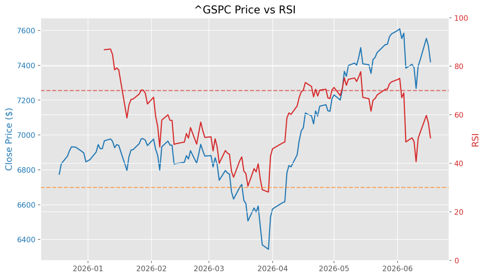

# [Part 3/8] MLOps Systems: Feature Engineering: Relative Strength Index (RSI) in Python
The Relative Strength Index (RSI) is one of the most widely used momentum indicators in technical analysis, but its real engineering value shows up when it is implemented as a reusable, pipeline-safe feature. In this implementation, I explain RSI and abstract it into a deterministic transformation over market data, which makes it suitable for analytics pipelines and any further downstream modeling. By the end, you will know how to build and interpret RSI output that is safe to integrate into a broader pipeline. This article is part of the MLOps Systems: Feature Engineering track, where we move from indicator mechanics to production-ready feature workflows.



The above image shows the close price of the S&P500 index along with RSI over the first 6 months of 2026. The dotted lines at 30 and 70 serve as critical thresholds to indicate potential market movement.

## Problem

Raw price levels rarely say enough on their own. If raw values are used directly in alerts, dashboards, or models, one can obtain jittery outputs and misleading triggers. What often matters more is whether recent gains are consistently stronger than recent losses.

## Solution Candidate (RSI)

RSI captures the balance between recent gains and losses by converting directional price movement into a bounded momentum score from 0 to 100. This bounded scale is easier to compare across dates and instruments than raw returns or price deltas.

Common interpretations are:
- **RSI above 70 (overbought):** Price may have risen too quickly and could be vulnerable to a pullback or short-term reversal.
- **RSI below 30 (oversold):** Price may have fallen too sharply and could be positioned for a short-term bounce.

These levels are not standalone buy/sell signals, but they are useful context when combined with trend, volume, and risk controls.

## Solution (Code)

The following function validates input, computes daily price changes, separates gains from losses, and then applies Wilder-style smoothing before deriving the final RSI column.

```python
def compute_rsi(
    data: pd.DataFrame,
    window: int = 14,
    close_column: str = "Close",
) -> pd.DataFrame:
    if data.empty:
        raise ValueError("Input data is empty.")
    if close_column not in data.columns:
        raise ValueError(f"Missing required column: {close_column}")
    if window <= 0:
        raise ValueError("window must be a positive integer.")

    engineered = data.copy()
    close = engineered[close_column]
    delta = close.diff()
    gain = delta.clip(lower=0)
    loss = (-delta).clip(lower=0)

    avg_gain = gain.ewm(alpha=1 / window, min_periods=window, adjust=False).mean()
    avg_loss = loss.ewm(alpha=1 / window, min_periods=window, adjust=False).mean()

    rs = avg_gain / avg_loss
    engineered[f"rsi_{window}"] = 100 - (100 / (1 + rs))

    return engineered
```

### Step 1: Validate the input

The function rejects empty data, missing close-price columns, and non-positive windows. That matters because technical indicators fail in subtle ways when fed malformed data, and bad validation usually surfaces later as misleading features rather than immediate exceptions.

### Step 2: Convert prices into directional changes

The dataframe operator `diff()` transforms the close series into day-over-day movement. That creates the raw data needed for momentum analysis.

### Step 3: Split movement into gains and losses

Positive deltas are retained in a new series called gain and negative deltas are inverted into a loss series. This is the core abstraction behind RSI: not how much price moved in total, but how much of that movement was upward versus downward.

### Step 4: Apply Wilder smoothing

The implementation uses exponential weighting with `alpha = 1 / window`, which is a standard way to model Wilder's smoothing in pandas. This makes the indicator responsive without being overly noisy.

### Step 5: Normalize to a bounded oscillator

The final score is derived from the relative strength ratio:

- `RS = average gain / average loss`
- `RSI = 100 - (100 / (1 + RS))`

This yields a bounded feature that is easy to interpret and safe to join into a broader feature table.

## Design Decisions and Edge Case Handling

The implementation makes several notable design decisions:

1. Copies the dataframe instead of mutating the caller's object.
2. Parameterizes the close column and window size for reusability.
3. Names the output column dynamically as `rsi_<window>`, keeping multiple RSI windows composable.
4. Rejects edge cases immediately at the entry point - a `window` of zero or less is invalid, and a missing close-price column raises right away, preventing silent data corruption.

## Tradeoffs and Pitfalls

- Warmup rows remain `NaN` because the function delegates missing-value policy to the caller. That is usually the right choice in pipelines, but it means downstream steps must decide whether to drop or preserve early rows.
- If average loss becomes zero during a sustained uptrend, RSI approaches 100, which is mathematically expected but should be interpreted carefully in models.

## Usage and Considerations

> **Pro Tips**
> **Pro Tip 1** - Generate multiple RSI windows, such as 7, 14, and 21, when you want short- and medium-term momentum views in the same dataset.
> **Pro Tip 2** - Keep RSI as one feature among many. On its own, RSI is descriptive, not predictive.
> **Pro Tip 3** - Document your warmup-row policy explicitly so training and scoring pipelines treat `NaN` periods consistently.

## Conclusion

This RSI implementation is more than a technical-analysis helper. It turns market behavior into a reusable, pipeline-friendly feature with clear validation and predictable output semantics.

Key takeaways:

- RSI is a bounded, momentum-based feature that is easier to interpret and compare across instruments than raw price deltas.
- Built-in validation and immutable output make it a reliable primitive in production feature pipelines.
- Production use should include a clear warmup-row policy so training and scoring pipelines handle early `NaN` values consistently.

## Further Reading

- Wilder-style smoothing versus simple rolling averages
- Momentum oscillators in time-series feature sets
- Handling warmup nulls in financial feature engineering

---

*Series: MLOps Systems — Feature Engineering*

| | |
|---|---|
| **← Previous** | [Part 2/8 — EMA Primer: From a Loop to pandas](exponential-moving-average-primer-blog.md) |
| **This post** | Part 3/8 — RSI |
| **Next →** | [Part 4/8 — MACD: Moving Average Convergence Divergence](macd-blog.md) |
